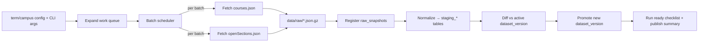

# SOC API → SQLite Initialization Flow (T-20251113-act-001-soc-json-scraper-ST-02)

> 目标：将 term × campus 队列从 Rutgers SOC API 拉回的课程/空位 JSON，经过原始快照保存、结构化转换、差异计算与发布，最终在本地 SQLite 中形成可查询/可通知的数据集。此流程直接指导 `scripts/fetch_soc_data.ts` 与相关 CI 自动化的实现。

## 1. Scope, assumptions & external inputs

| 类别 | 说明 |
| --- | --- |
| 支持范围 | 多 term × campus（NB/NK/CM/ONLINE_* 等），每个组合包括 `courses.json` 与 `openSections.json`，并引用 `initJsonData` 维度。 |
| 依赖文档 | `docs/soc_api_handbook.md`（节奏/限流）、`docs/db/conceptual_model.md`（表结构）、`docs/db/ready_checklist.md`（验收）。 |
| 配置来源 | `config/terms.yaml`（term/year）、`config/campuses.yaml`（校区代码）、可选 `config/subjects.json`（白名单/黑名单）。脚本以 CLI 参数 `--terms`, `--campuses`, `--mode=full|incremental` 接收覆盖。 |
| 输出承诺 | `data/raw/*.json.gz`、`data/raw/manifest.jsonl`、SQLite (`data/courses.sqlite`) 中的 `raw_snapshots` / `dataset_versions` / `vw_active_*` 均更新，并生成 `logs/fetch_soc_data/<ts>.jsonl` + 运行摘要。 |

## 2. Flow overview (one term × campus batch)

> ASCII fallback: Config → Work Queue Expansion → Scheduler → {courses.json fetch, openSections.json fetch} → Raw snapshots (files + metadata) → Normalize to staging tables → Diff & Promote dataset version → Ready checklist + summary。

## 3. Stage-by-stage detail

### 3.1 Stage A — Expand term/campus queue
- **输入**：CLI `--terms` / `--campuses` / `--mode`, `config/terms.yaml`, `config/campuses.yaml`，以及上一版本的 `dataset_versions`（判断增量所需）。
- **动作**：
  1. 解析 CLI 与配置，生成 `WorkItem {term_code, campus_code, year, term, mode}`；若 `--mode=incremental` 则优先队列 `dataset_versions.active=0` 但存在 update_flag=1 的组合。
  2. 交叉乘 term × campus，过滤 `campus.enabled=false`，再按优先级（例如即将注册期的 term）排序。
  3. 将工作项写入 `data/tmp/<run_id>/work_queue.json`，提供断点续跑能力。
- **输出/产物**：`work_queue.json`、初始日志事件 (`logs/fetch_soc_data/<run_id>.jsonl`)；用于下一阶段的 `Scheduler`。
- **并发性**：纯配置处理，整个 pipeline 串行执行一次。

### 3.2 Stage B — Scheduler & API 调用批次
- **输入**：`work_queue.json`、`docs/soc_api_handbook.md` 中的节奏限制、`fetch_soc_data` CLI 选项（`--max-workers`, `--request-interval`）。
- **动作**：
  1. 将队列切分为批次（默认 `courses` 单线程；`openSections` 可 campus 级并行≤3）。
  2. Scheduler 负责注入 `User-Agent`、`Accept-Encoding: gzip`、`If-None-Match`（若已有缓存），并对同一 term × campus 的 courses 与 openSections 严格串行，避免混合写入。
  3. 每个请求记录 `request_id`, `attempt`, `timeline_ms`；非 200 响应触发指数退避（30s → 60s → 120s）。
- **输出/产物**：
  - `data/raw/<term>_<campus>_<endpoint>_<ts>.json.gz`（原始 gzip）。
  - `data/raw/manifest.jsonl` 追加记录 `{snapshot_id, term, campus, endpoint, etag, sha256, payload_bytes, attempts}`。
  - `logs/fetch_soc_data/<run_id>.jsonl` 追加请求/错误事件。
- **并发性**：跨 term/campus 的 batches 可并行，单组合串行；Scheduler 是异步事件循环。

### 3.3 Stage C — Snapshot validation & registration
- **输入**：Stage B 产出的 gzip 文件 + manifest 行、`data/courses.sqlite` 中的 `raw_snapshots`、`raw_snapshot_blobs` 表。
- **动作**：
  1. Synchronously 验证 gzip 可解压、JSON 结构为数组；如果 size 或记录数与 manifest 不一致则标记 failed 并重排入队。
  2. 将 metadata 写入 `raw_snapshots`，包括 `snapshot_id`, `term_code`, `campus_code`, `endpoint`, `captured_at`, `payload_sha256`, `record_count`, `etag`, `source_path`。
  3. 可选：若 `--inline-blob` 打开，则将 gzip 内容写入 `raw_snapshot_blobs` 以便无文件系统部署。
  4. 对 `manifest.jsonl` 打标签 `imported=true`，防止重复入库。
- **输出/产物**：DB 中新的 `raw_snapshots` 行、更新后的 manifest；`data/tmp/<run_id>/snapshot_registry.json`（记录 snapshot_id 对应 staging 状态）。
- **并发性**：单个 snapshot 注册在 SQLite 事务内串行执行；不同 term/campus 可顺序处理，避免写锁冲突。

### 3.4 Stage D — Normalize to staging tables
- **输入**：`raw_snapshots` 行（courses + openSections）、`docs/db/conceptual_model.md` 定义的 `staging_*`、`dataset_versions` 当前 active 版本。
- **动作**：
  1. `normalize_snapshot(term, campus, snapshot_id)` 解压 JSON → 逐条 course/section/meeting 写入 `staging_courses`, `staging_sections`, `staging_meetings`, `staging_open_sections`，并保留 `raw_payload`。
  2. 在单事务内写入 staging，并记录 `staging_runs` 表（性能指标 + source snapshot）。
  3. 当 courses 与 openSections 均完成后，创建 `staging_dataset_version` 记录（状态=diff_pending）。
- **输出/产物**：staging 表、`staging_runs` 记录、`staging_dataset_version`。
- **并发性**：Term × campus 粒度可并行运行，但每个组合内部 courses→openSections 顺序固定，确保 staging consistency。

### 3.5 Stage E — Diff & promote dataset version
- **输入**：`staging_*`、`dataset_versions` 当前 active、`open_section_states`（用于增量 diff）。
- **动作**：
  1. `diff_active_vs_staging` 比较课程/section 主键，生成 `diff_report.json`（新增/更新/删除计数、字段级变化示例），写入 `data/tmp/<run_id>/<term>_<campus>_diff.json`。
  2. 若 `--mode=incremental` 且 diff 为空，仅更新 `dataset_versions.last_verified_at`，跳过 promote。
  3. 否则在单事务内：
     - 清空 `staging_to_promote` 视图 → upsert 至 `courses`, `sections`, `meetings`, `open_section_states`。
     - 插入新的 `dataset_versions` 行（status=active），并将旧版本标记为 archived。
     - 记录 `dataset_version_events`（`diff`, `promote`）。
- **输出/产物**：`
  - canonical 表中更新的数据。
  - `dataset_versions` 新行 + events。
  - `data/tmp/..._diff.json`（供人工复核）。
- **并发性**：Promote 需要获取数据库写锁，因此每次仅允许一个 term × campus 进入该阶段（串行）。

### 3.6 Stage F — Ready checklist & publication
- **输入**：`dataset_versions` 新行、`docs/db/ready_checklist.md`、`vw_active_*` 视图、`open_section_events`。
- **动作**：
  1. 运行 ready checklist 自动化：
     - 校验 courses/sections 记录数 >0，`vw_active_sections` 能查询指定样本 index。
     - 校验索引存在 (`sqlite_master` 查询)；spot-check 10 门课程 vs `courses.json`。
     - 生成 `ready_report_<term>_<campus>.md`（存于 `data/tmp/<run_id>/ready/`）。
  2. 生成 run summary：`summary.json` 包含 term/campus、snapshot_id、diff 计数、准备耗时、下次建议刷新时间。
  3. 若 ready 失败则保持旧版本 active，并在 `dataset_version_events` 写 `abort`，待人工介入。
- **输出/产物**：`data/tmp/<run_id>/ready/ready_report_*.md`、`summary.json`、更新的日志。
- **并发性**：串行（需要读取 promote 结果）；ready 通过后才允许下一个 term × campus 的 promote 队列出队。

## 4. Parallel vs. serial phases

| 阶段 | 并发策略 | 说明 |
| --- | --- | --- |
| Stage A | 串行 | 配置解析极轻，保持单次运行。 |
| Stage B | term × campus 并行（≤3 workers），同一组合串行 | Scheduler 控制总体 RPS，遵守 API 限制。 |
| Stage C | 串行 | SQLite 事务写 `raw_snapshots`，避免锁冲突。 |
| Stage D | term × campus 并行 | 每个组合独立的 staging 表写入；需确保磁盘空间。 |
| Stage E | 串行 | Promote 需要全局写锁并更新 canonical 表。 |
| Stage F | 串行 | Ready check依赖 Stage E 的结果。

## 5. Script boundaries & interfaces

| 组件 | 角色 | API/接口 |
| --- | --- | --- |
| `scripts/fetch_soc_data.ts` | 主 orchestrator：解析 CLI、驱动 Stage A–F、输出日志与报告。 | CLI：`--terms`, `--campuses`, `--mode`, `--max-workers`, `--inline-blob`, `--resume-run <run_id>`. |
| `scripts/fetch_soc_samples.py`（可复用） | 执行单次 HTTP 请求、写 gzip 与 manifest | 函数：`fetch_snapshot(work_item, endpoint)` 返回 `{snapshot_id, path, metrics}`。 |
| `scripts/migrate_db.ts` | 提供 `normalize_snapshot`, `diff_active_vs_staging`, `promote_dataset_version` 等 DB 操作；由 orchestrator 调用。 | 调用方式：Node `import`, 或 CLI 子命令 `migrate-db normalize --snapshot-id`. |
| SQLite (`data/courses.sqlite`) | 统一数据源 | 表/视图遵循 `docs/db/conceptual_model.md`。 |

## 6. Failure, retry & observability nodes

- **重试节点**：Stage B（网络/HTTP，可自动退避 ≤3 次）、Stage C（校验失败 → 重推 fetch）、Stage E（diff/promote 失败 → 回滚事务并重新排队）。
- **告警事件**：
  1. 某 term × campus 在 Stage B 失败 ≥3 次；
  2. Stage D 解析耗时 >5 min 或 JSON 结构异常；
  3. Ready checklist 未通过。对应事件写入 `dataset_version_events` 并触发 Slack/Email。
- **指标采集**：所有阶段将 `run_id`, `work_item_id`, `snapshot_id`, `version_id` 写入日志，便于串联 trace。`logs/fetch_soc_data/*.jsonl` 是 JSON per line，可被 Filebeat 上传。

---

该文档提供了 term × campus 粒度建库的端到端链路、关键产物以及并发/串行约束，可直接用来实现/验证 `scripts/fetch_soc_data.ts`。完成后即可启动 ST-03 的建库检查与重建策略定义。
