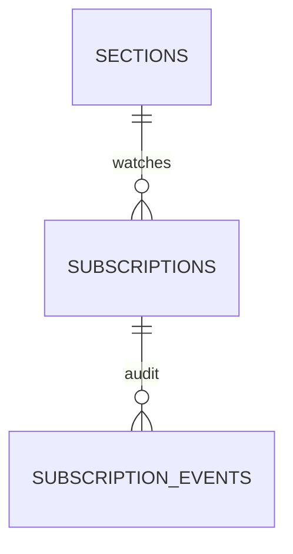
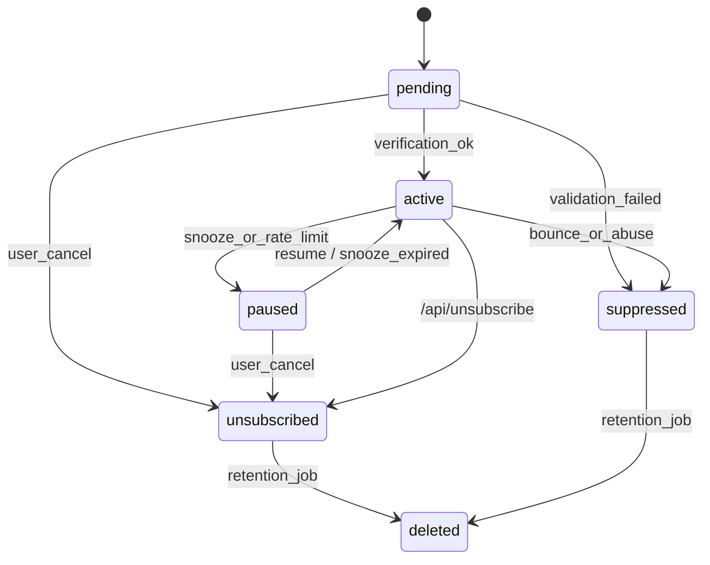

# Subscription Data Model & API Contract

## Scope and goals
- Define the contract between the UI, API layer, and SQLite schema when a user requests seat opening notifications.
- Ensure downstream tasks (`subscriptions` write path, notification worker, UI subscribe modal) share one source of truth for fields, constraints, and lifecycle semantics.
- Call out validation, rate limits, and dedup strategies so the implementation can stay cheap to operate while being resilient against spam or duplicate submissions.

## Entities overview


- `sections` is already defined in `docs/local_data_model.md` and provides `section_id`, `term_id`, `campus_code`, and `index_number`.
- `subscriptions` holds the user request plus normalized contact and preference data.
- `subscription_events` is the append-only audit log for status transitions, notification attempts, and errors.

## `subscriptions` table

| Column | Type | Example | Notes |
| --- | --- | --- | --- |
| `subscription_id` (PK) | INTEGER | `8231` | Auto-increment surrogate key surfaced back to clients. |
| `section_id` (FK) | INTEGER | `512345` | References `sections.section_id`. Nullable when the section has been purged yet the subscription still exists; the denormalized keys keep it alive. |
| `term_id` | TEXT | `20241` | Copied from the section to avoid joins when looking up by term + index. |
| `campus_code` | TEXT | `NB` | Mirrors `sections.campus_code`. |
| `index_number` | TEXT | `12345` | Section index users enter in the UI; required to be unique per term/campus via `sections` table. |
| `contact_type` | TEXT | `email` | Enum: `email`, `discord_user`, `discord_channel`. Drives channel-specific validation and worker selection. |
| `contact_value` | TEXT | `student@example.edu` | Raw user input after trimming; only stored in clear text when unavoidable (email). |
| `contact_hash` | TEXT | `sha1(student@example.edu)` | Always lower-cased SHA1 of `contact_value`. Enables uniqueness + per-contact rate limiting without storing redundant PII. |
| `locale` | TEXT | `en-US` | Used by email templates and discord copy. Defaults to deployment locale when omitted. |
| `status` | TEXT | `pending` | Enumerated values described below (`pending`, `active`, `paused`, `suppressed`, `unsubscribed`). |
| `is_verified` | INTEGER | `0` or `1` | Reflects the double-opt-in state for email and Discord DM flows. |
| `created_at` | TEXT | ISO string | UTC timestamp generated by the API server. |
| `updated_at` | TEXT | ISO string | UTC timestamp touched on every status/pref change. |
| `last_notified_at` | TEXT | ISO string | Tracks throttling between sends and enforces `maxNotifications`. |
| `last_known_section_status` | TEXT | `Closed` | Snapshot of the last section `open_status` processed for this subscription to avoid duplicate sends. |
| `unsubscribe_token` | TEXT | `b0d4...` | 32+ char random token hashed into links and the `/api/unsubscribe` payload. |
| `metadata` | TEXT (JSON) | `{...}` | JSON blob that includes the preference object, Discord/channel binding, and client context. |

### Preferences payload (`metadata.preferences`)

| Field | Type | Default | Notes |
| --- | --- | --- | --- |
| `notifyOn` | Array&lt;`"open"` \| `"waitlist"`&gt; | `["open"]` | Controls which section states should trigger notifications. `"waitlist"` is optional for courses that expose waitlist-only openings. |
| `maxNotifications` | Integer | `3` | Hard cap of sends per enrollment window. Once reached the subscription auto-transitions to `paused`. |
| `deliveryWindow` | `{ startMinutes: number, endMinutes: number }` | `0-1440` | Optional quiet hours in minutes after midnight (local campus time). Notifications outside the window land in `pending_send` queue until the window re-opens. |
| `snoozeUntil` | ISO timestamp | `null` | When set the status flips to `paused` until the timestamp expires. |
| `channelMetadata` | Object | `{}` | Channel-specific knobs such as Discord guild/channel IDs or message template overrides. |

Other JSON siblings under `metadata`:
- `client` &rarr; `{ ip: string, userAgent: string }` for abuse triage (never exposed back to the UI).
- `discord` &rarr; `{ guildId, channelId, userId }` used when `contact_type` references Discord.
- Future fields must be **appended**, never removed, to keep migrations additive.

### Indexes and constraints
- `idx_subscriptions_active_unique` (partial unique) on `(section_id, contact_hash, contact_type)` when `status IN ('pending','active')` blocks duplicate requests for the same section/channel pair.
- `idx_subscriptions_unresolved_unique` (partial unique) on `(term_id, campus_code, index_number, contact_hash, contact_type)` where `section_id IS NULL AND status IN ('pending','active')` keeps unresolved subscriptions idempotent until the section row is backfilled.
- `idx_subscriptions_active` on `(section_id, status)` is used by the notification worker to fetch candidates who still need alerts.
- `contact_hash` is always derived by `sha1(lower(trim(contact_value)))`. Clients never set it directly.
- When `section_id` is absent the API enforces uniqueness via the `(term_id, campus_code, index_number, contact_hash, contact_type)` tuple so retries reuse the existing unresolved row.
- `section_id` can be resolved lazily: the API should fill it when a section exists and defer to `term_id + index_number` otherwise so we can still clean up when the section reappears.

## `subscription_events` table

| Column | Type | Notes |
| --- | --- | --- |
| `event_id` (PK) | INTEGER | Auto-increment. |
| `subscription_id` | INTEGER | FK to `subscriptions`. |
| `event_type` | TEXT | Enum listed below. |
| `section_status_snapshot` | TEXT | Stores the section `open_status` or derived state at the moment the event fired. |
| `payload` | TEXT (JSON) | Channel-specific metadata (email message id, Discord error text, validation reasons, etc.). |
| `created_at` | TEXT | UTC timestamp. |

### Event types
`event_type` is a constrained string with the following canonical values:

| Type | Producer | Description |
| --- | --- | --- |
| `created` | `/api/subscribe` | Fresh row inserted (`status=pending`). |
| `verification_sent` | `/api/subscribe` | Email/Discord DM verification dispatched. Payload includes provider message id. |
| `verified` | verification callback | Contact confirmed, flips to `active`. Payload carries the verification channel. |
| `status_changed` | `/api/subscribe` or worker | Any transition among `pending/active/paused/suppressed/unsubscribed`. Payload describes `from` and `to`. |
| `notify_sent` | notification worker | Alert message delivered. Payload captures `traceId`, template id, and `section_status_snapshot`. |
| `notify_failed` | notification worker | Channel rejected the send. Payload includes error + retry policy. |
| `unsubscribed` | `/api/unsubscribe` | User-initiated cancellation. |

## Status model and transitions

| Status | Meaning | Typical transitions |
| --- | --- | --- |
| `pending` | Request recorded but awaiting double opt-in or Discord handshake. | `pending -> active` upon verification, `pending -> suppressed` when validation fails, `pending -> unsubscribed` if user cancels before verifying. |
| `active` | Eligible to receive notifications. | `active -> paused` when hitting `maxNotifications`/snooze, `active -> suppressed` after hard bounce, `active -> unsubscribed` when user cancels. |
| `paused` | Temporarily disabled by the user or system (snooze, quiet hours). | `paused -> active` when resumed or `snoozeUntil` passes, `paused -> unsubscribed` if user cancels. |
| `suppressed` | Permanently blocked because of validation failure, bounce, or abuse. | Only moves to `deleted` during retention cleanup. |
| `unsubscribed` | User or admin removed the watch. | Terminal status; rows eventually age out and become `deleted` during archival. |

State transitions are driven by the API and worker flows outlined below.



Every transition writes a `subscription_events` row so ops teams can reconstruct the lifecycle.

## API contracts

### `POST /api/subscribe`
Creates or reuses a subscription for the provided section/index.

**Request body**

| Field | Type | Required | Notes |
| --- | --- | --- | --- |
| `term` | string | Yes | Matches `term_id`. Helps disambiguate when the same index appears in multiple terms. |
| `campus` | string | Yes | `NB`, `NK`, `CM`, etc. |
| `sectionIndex` | string | Yes | Numeric index the user sees in SOC. |
| `contactType` | `"email" \| "discord_user" \| "discord_channel"` | Yes | Controls validation + verification flow. |
| `contactValue` | string | Yes | Email address or Discord user/channel snowflake. Trimmed before hashing/storing. |
| `locale` | string |  | Defaults to deployment locale; determines template language. |
| `preferences` | object |  | Partial object that overrides `metadata.preferences`. Missing fields fall back to defaults defined above. |
| `clientContext` | `{ ip?: string; userAgent?: string }` |  | Optional. Server still populates from request metadata for traceability. |
| `discord` | `{ guildId?: string; channelId?: string }` |  | Only used when `contactType` references Discord. |

- The API looks up the `sections` row by `(term, campus, sectionIndex)`. When found the row's `section_id` populates the subscription immediately. When missing (e.g., data lag or removed section) the API still accepts the request, stores the denormalized `term/campus/index` with `section_id = null`, derives an internal `unresolvedKey = sha1(term|campus|index|contact_hash|contact_type)` (or hashes the tuple `(term, campus, index, contact_hash, contact_type)`) for duplicate detection, and flags the response with `sectionResolved: false` so callers know the join is deferred. Only malformed `term`/`campus` combinations return `404 section_not_found`.
- `contact_hash` is computed server-side; the unique partial index guarantees idempotency. When a matching `pending/active` record exists the endpoint returns `200` with `existing: true` and never inserts a duplicate.
- New rows start in `pending` unless `contactType=discord_channel` (server-to-server) in which case they skip verification and go straight to `active`.
- Email + Discord DM requests trigger a verification message and append `verification_sent` events. The response includes `requiresVerification: true`.
- The response emits a `traceId` header + field so UI logs can correlate with backend traces.

**Response shape**

| Field | Type | Notes |
| --- | --- | --- |
| `subscriptionId` | number | Present for both new and reused subscriptions. |
| `status` | string | Current lifecycle status. |
| `requiresVerification` | boolean | `true` when the server dispatched a verification email/DM. |
| `existing` | boolean | `true` when the request hit the unique constraint and returned the prior row. |
| `unsubscribeToken` | string | Nullable when the contact type cannot be unsubscribed without auth (e.g., Discord channel webhooks). |
| `term`, `campus`, `sectionIndex` | string | Echo back resolved routing data. |
| `sectionResolved` | boolean | `false` when `section_id` could not be attached yet; clients may show a warning but no retry is needed. |
| `preferences` | object | Effective preference set after merging defaults and payload overrides. |
| `traceId` | string | Mirrors `X-Trace-Id` header. |

**Example**

```json
POST /api/subscribe
{
  "term": "20241",
  "campus": "NB",
  "sectionIndex": "12345",
  "contactType": "email",
  "contactValue": "student@example.edu",
  "locale": "en-US",
  "preferences": {
    "notifyOn": ["open", "waitlist"],
    "maxNotifications": 5
  }
}

201 Created
{
  "subscriptionId": 8231,
  "status": "pending",
  "requiresVerification": true,
  "existing": false,
  "unsubscribeToken": "b0d4c5ab88974b0ea4ddf0ee1f6f6d7b",
  "term": "20241",
  "campus": "NB",
  "sectionIndex": "12345",
  "preferences": {
    "notifyOn": ["open", "waitlist"],
    "maxNotifications": 5,
    "deliveryWindow": { "startMinutes": 0, "endMinutes": 1440 }
  },
  "traceId": "c95feef9b7a54e03"
}
```

**Error codes**
- `400` `invalid_contact` &rarr; malformed email/Discord snowflake, unsupported locale, or missing fields.
- `400` `rate_limited` &rarr; per-IP or per-contact throttle exceeded.
- `404` `section_not_found` &rarr; the provided `term` or `campus` is unknown/disabled for this deployment. When the term/campus is valid but the specific `sectionIndex` is missing in the DB, the API still returns `200` with `sectionResolved: false`.
- `409` `section_conflict` &rarr; the section exists in a different term/campus than the payload; the response includes the canonical term/campus to guide UI fixes.

### `POST /api/unsubscribe`
Cancels a subscription using either the numeric ID (signed user flows) or the opaque token (email link flows).

**Request body**

| Field | Type | Required | Notes |
| --- | --- | --- | --- |
| `subscriptionId` | number | Yes\* | Required when the caller is authenticated (UI session or Discord slash command). |
| `unsubscribeToken` | string | Yes\* | Required when the caller is anonymous (email link). At least one of `subscriptionId` or `unsubscribeToken` must be present. |
| `contactValue` | string |  | Optional secondary check for UI flows so that a stale token cannot sever someone else's subscription. |
| `reason` | string |  | Optional telemetry, e.g., `user_request`, `too_many_emails`, `channel_deleted`. |

**Behavior**
- Looks up the row by `(subscription_id)` when provided; otherwise matches `unsubscribe_token`.
- If the row is already `unsubscribed` the endpoint responds with `200` and `previousStatus: "unsubscribed"` (idempotent).
- When the row is `pending` or `active`, the API flips `status` to `unsubscribed`, clears `is_verified`, writes an `unsubscribed` event, and obfuscates the `contact_value` to reduce retained PII.
- Unknown tokens return `404` `subscription_not_found` without revealing whether the token ever existed.

**Response shape**

| Field | Type | Notes |
| --- | --- | --- |
| `subscriptionId` | number | Echoed when known. |
| `status` | `"unsubscribed"` | Always the terminal status after this call. |
| `previousStatus` | string | Helps the UI show "You were already unsubscribed" vs "Success" copy. |
| `traceId` | string | For logging. |

**Example**

```json
POST /api/unsubscribe
{
  "unsubscribeToken": "b0d4c5ab88974b0ea4ddf0ee1f6f6d7b",
  "reason": "user_request"
}

200 OK
{
  "subscriptionId": 8231,
  "status": "unsubscribed",
  "previousStatus": "active",
  "traceId": "d012fe48bf39408c"
}
```

## Validation, rate limits, and safety policies
- **Contact validation**: Email addresses must pass RFC 5322-light regex, strip display names, lowercase the domain, and reject disposable domains listed in `configs/disposable_emails.txt`. Discord IDs must be 17-19 digit snowflakes; channel subscriptions additionally require guild ownership verification.
- **Rate limits**:\
  `perContact`: max 3 active subscriptions per `(contact_hash, contact_type)` across all sections.\
  `perSection`: max 50 active subscriptions per section to keep notification fan-out bounded for MVP, adjustable later.\
  `perIP`: sliding window (e.g., 10 create attempts / 10 minutes) enforced before parsing payloads to deflect bots.
- **Deduplication**: The partial unique index + `contact_hash` ensures the API is idempotent. When duplicates occur the server returns the existing record and surfaced status so the UI can show "You are already subscribed" copy.
- **Verification + suppression**: Email and Discord DM flows remain in `pending` until verification links are clicked. Repeated bounces move the status to `suppressed`, preventing future calls from reactivating the same hash without operator intervention.
- **Quiet hours**: Subscriptions with `deliveryWindow` outside of 24/7 operate via the worker honoring `startMinutes/endMinutes`, storing deferrals in `metadata` so reboots survive.
- **Auditing and compliance**: Every status change, notification, or API request spawns a `subscription_events` row. `unsubscribe_token` values are random 128-bit hex strings stored in clear text so that links stay deterministic; loggers must redact them.
- **PII handling**: `contact_value` is only stored for channels that require it; other flows prefer `contact_hash`. When a subscription hits `unsubscribed` or `suppressed`, the implementation should blank `contact_value` while retaining the hash for dedup.

This document is the reference for `ST-20251113-act-009-02-subscribe-endpoints` and later notification worker tasks--any schema or contract change must be reflected here first.
